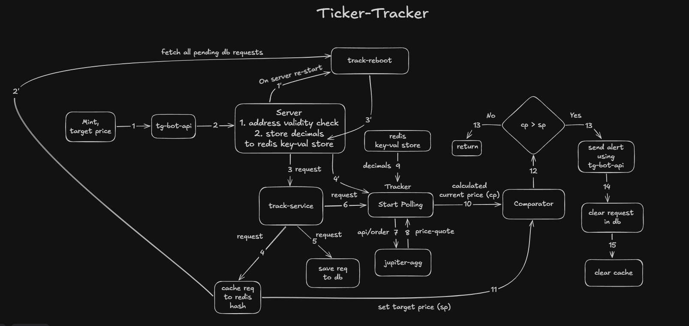

# Ticker-Tracker

A Telegram bot for tracking Solana tokens and receiving price alerts based on user-defined thresholds.

## Features

- Track a Solana token using its mint address.
- Set a target price for the token.
- Monitor the token price continuously.
- Receive a Telegram notification when the price reaches or crosses the target.
- Conversational flow for creating a tracking request.

## Commands

| Command       | Description                                              |
| ------------- | -------------------------------------------------------- |
| `/start`      | Introduces the bot and explains its functionality.       |
| `/trackasset` | Starts the process of creating a token tracking request. |
| `/help`       | Displays the available commands and their descriptions.  |

## How It Works

The user starts a tracking request using `/trackasset`. The bot collects the required information, including the Solana token mint address and the desired price threshold.

Once the request is created, the bot monitors the token price and sends a Telegram notification when the configured threshold is reached or crossed.

## Architecture



## Data Model

| userid       | tickermint                                   | threshold |
| ------------ | -------------------------------------------- | --------- |
| `tg-chat-id` | 7x625ySohTvGL9hmFm6tBssCQ5xTUsH1RYM5L1xipump | 0.00009   |

## Example

```text
/trackasset

Bot: Enter the token mint address:
User: <token-mint-address>

Bot: Enter the target price:
User: 0.05

Bot: Tracking started.
```

When the target price is reached or crossed, the bot sends an alert to the user.

## Setup

### Prerequisites

- Node.js
- postgresql
- redis
- Telegram Bot Token
- RPC url
- Jupiter api token

### Installation

```bash
git clone <repository-url>
cd <project-directory>

npm install
```

Create a `.env` file containing the required configuration:

```env
PORT=<port-number-for-your-server>
TG_BOT_API_KEY=<tg-bot-api-key>
JUPITER_API_KEY=<jupiter-api-key>
PG_CONNECTION_STRING=<postgresql-connection-string>
REDIS_CONNECTION_STRING=<redis-connection-string>
HELIUS_RPC_URL=<RPC_URL>
```

Add any additional environment variables required by the application.

### Running the Bot

Development:

```bash
npm run dev
```

Production:

```bash
npm run build
npm start
```

## Usage

1. Open the bot in Telegram.
2. Run `/start`.
3. Run `/trackasset`.
4. Provide the Solana token mint address.
5. Provide the target price.
6. The bot starts monitoring the token.
7. Receive an alert when the target price is reached or crossed.

Run `/help` at any time to view the available commands.
